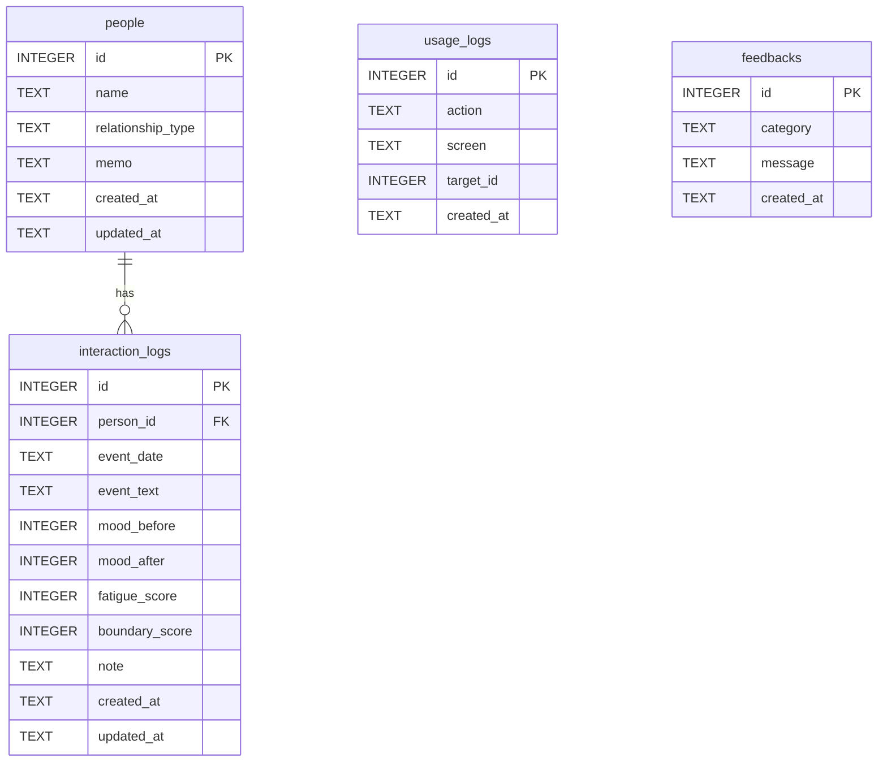

# ひと距離メモ MVP

人と関わった後の疲労度・気分変化・次回の距離感を記録し、自分にとって無理のない人間関係パターンを振り返るためのMVPアプリです。

このアプリは医療・カウンセリング・診断を目的としません。自己記録と振り返りのためのツールです。

## 技術スタック

- React Native
- Expo
- expo-sqlite
- Docker / Docker Compose

## Dockerで起動

Ubuntu / WSL のプロジェクトディレクトリで実行します。

```bash
cd /home/okiju/Dev/hito_kyori_memo_mvp
docker compose up
```

ブラウザで開きます。

```text
http://localhost:8080
```

バックグラウンド起動する場合:

```bash
docker compose up -d
```

停止する場合:

```bash
docker compose down
```

コンテナを作り直す場合:

```bash
docker compose up -d --force-recreate
```

## Web版の保存について

Expo Webでは `expo-sqlite` がネイティブ端末と同じ形では使えないため、Web確認時は `localStorage` に保存します。

- ブラウザ確認: `localStorage`
- Expo Go / 実機: SQLite

Web版の記録は、このブラウザ内にのみ保存されます。別の端末や別のブラウザには同期されません。ブラウザのデータを削除すると、記録も消える場合があります。

Web版のデータを消す場合は、アプリ内の「このアプリについて」から「全データ削除」を使えます。

## Expo Goで確認

Docker起動後、ログに表示されるQRコードをExpo Goで読み取ります。

ログ確認:

```bash
docker compose logs -f app
```

## 主な機能

- 相手登録
- 対人記録の作成
- 5段階入力UI
- 記録履歴
- 記録詳細
- ルールベースコメント
- 直近7日間の分析
- 相手別の平均疲労度
- 統計インサイト
- このアプリについて
- フィードバック保存
- 全データ削除

## データ構造

実機ではSQLite、Web版では同じ構造のデータを `localStorage` に保存します。



`usage_logs.target_id` は記録や相手など複数種類の対象IDを入れるため、固定の外部キーとしては扱っていません。`feedbacks` はアプリ改善用の独立した記録です。

## ファイル構成

```text
hito_kyori_memo_mvp/
  App.js                         アプリ画面と画面切り替え
  src/
    db.js                        SQLite / Web localStorage の保存処理
    domain.js                    ラベル、コメント生成、統計ロジック
  Dockerfile                     Expo開発用Dockerイメージ
  docker-compose.yml             Docker Compose設定
  package.json                   npm scripts / dependencies
  hito_kyori_memo_mvp_spec.md    MVP仕様書
```

## よく使うコマンド

依存関係を含めてビルド:

```bash
docker compose build
```

Webバンドル確認:

```bash
docker compose run --rm app npx expo export --platform web --output-dir dist
```

サーバーの状態確認:

```bash
docker compose ps
```

ログ確認:

```bash
docker compose logs --tail=100 app
```

## 注意

初回起動時や依存関係変更後は、ブラウザに古いMetroキャッシュが残ることがあります。画面が更新されない場合は、ブラウザでハードリロードしてください。

```text
Ctrl + F5
```
